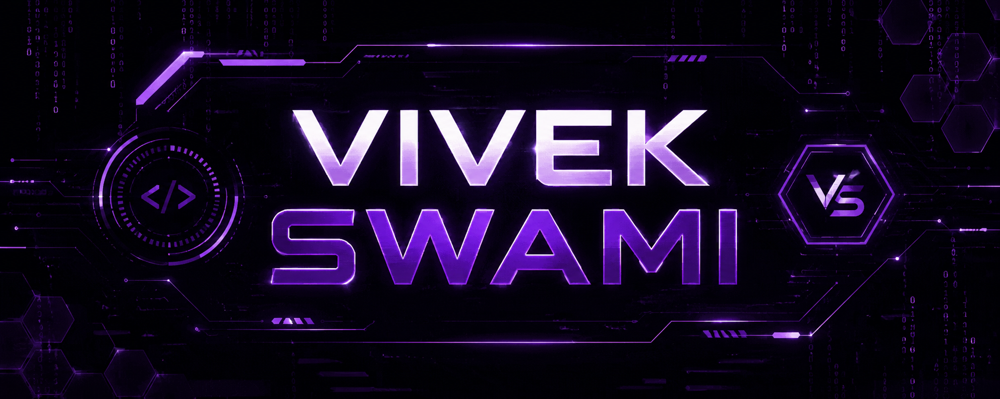

  

# 🧑‍💻 About Me

💡 Computer Engineering Student

🔐 Interested in Cybersecurity & AI Security

🚀 Building secure and scalable applications

🛡️ Currently working on:
- LLM Security Scanner

🌱 Learning:
- Cloud Security
- Secure SDLC
- DSA

---

## 🛠️ Tech Stack

### 💻 Development

  

### 🗄️ Databases

  

### 🔐 Security & Tools

  

OWASP • Burp Suite • Nmap

<td width="50%" valign="top">

### 🔐 Security & Tools

🛡️ OWASP • 🔎 Burp Suite • 🌐 Nmap • 🐧 Linux • 🐳 Docker •  Git • 💻 VS Code

</td>
</tr>
</table>
